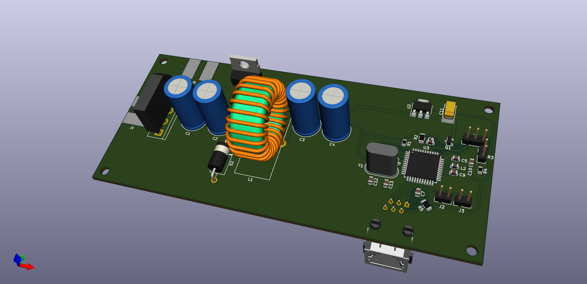
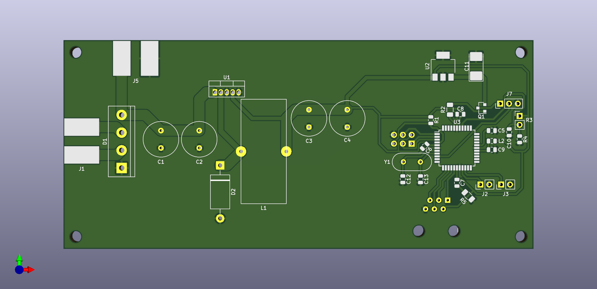
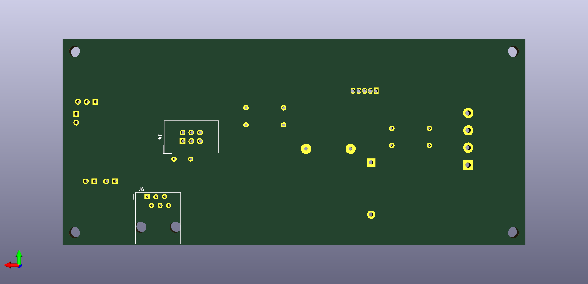

# Nixie-clock-main-board
Main PCB of my Nixie clock

## Board overview

- 12V AC input
- Rectified 12V AC output (around 16V DC, powering the [180V power supply](https://github.com/Kotbenek/180V-power-supply))
- ATmega32 AVR microcontroller as the heart of the Nixie clock
- Photoresistor input for PWM Nixie tubes dimming
- Two inputs for external buttons used for timezone setting (UTC offset): TIMEZONE- and TIMEZONE+
- GPS module connector (3.3V, ground and GPS_TX line) with power on/off capability
- 6P6C connector used for interfacing the Nixie tubes driver board
- AVR ISP connector for AVR programming

## Images

## External 3D models used in the PCB render

- [Bridge rectifier](https://grabcad.com/library/bridge-rectifier-kbp-case-1)
- [Toroid inductor](https://grabcad.com/library/inductor-toroid-25mm-1)
- [6P6C connector](https://grabcad.com/library/rj12-1)
